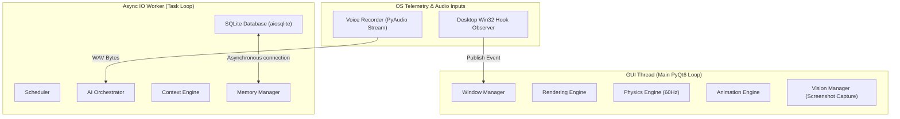
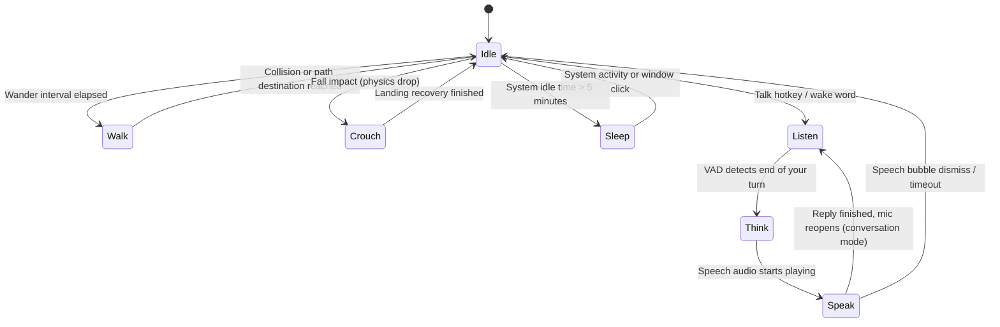
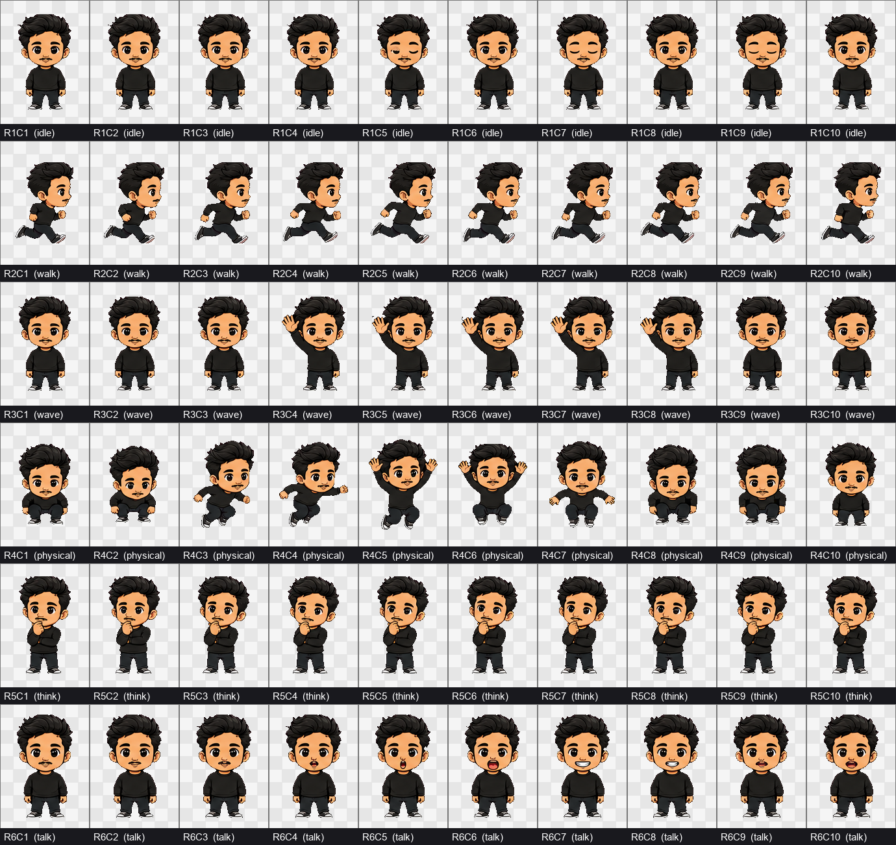

# Ambient AI Desktop Companion (Desk Pet)

An intelligent, lightweight, 2D virtual companion that lives directly on your Windows desktop. Designed as a living creature rather than a transactional chatbot, the pet walks, idles, reacts to user input, obeys gravity-based physics, remembers past conversations, and communicates using ambient typewriter dialogue powered by local triggers and external AI APIs.

---

## 📖 Table of Contents

1. [Vision & Design Philosophy](#-vision--design-philosophy)
2. [Core Features](#-core-features)
3. [Project Structure](#-project-structure)
4. [System Architecture](#-system-architecture)
   - [Asynchronous Event Bus](#asynchronous-event-bus)
   - [Thread Ownership Boundaries](#thread-ownership-boundaries)
   - [Mascot Animation State Machine](#mascot-animation-state-machine)
   - [Mascot Sprite Sheet & Frame Layout](#mascot-sprite-sheet--frame-layout)
5. [Database Schema](#-database-schema)
6. [API Integrations & Contracts](#-api-integrations--contracts)
7. [Performance Budgets](#-performance-budgets)
8. [Current Status & Audit Findings](#-current-status--audit-findings)
9. [Development Setup](#-development-setup)

---

## 🌟 Vision & Design Philosophy

Desktop Pet AI bridges the gap between static, repetitive desktop toys and heavy, intrusive browser-based AI chatbots. The key product principles are:

- **Always Ambient & Non-Intrusive:** The pet hovers over active workspaces without stealing keyboard focus or blocking critical OS UI (using `Qt.WindowType.Tool` window flags).
- **Physically Grounded:** Dropping or throwing the pet uses a custom kinematics simulation (60Hz loop) that calculates momentum, drag, and monitor bounds.
- **Contextually Aware:** Pulls local system metrics (battery, active foreground process, local time, and git/test status) to generate highly personalized developer-focused commentary.
- **Strict Decoupling:** All subsystems (UI, Physics, Animation, AI Orchestration, and Telemetry) communicate purely via an asynchronous event bus.

---

## 🛠️ Core Features

- **Frameless Transparent UI:** High-DPI responsive window that supports multi-monitor clipping and available work areas (excluding the system taskbar).
- **True Multi-Monitor Roaming:** The pet walks freely across the whole virtual desktop, while gravity still resolves against *each* monitor's own taskbar. Speech bubbles and screen capture follow it to whichever display it's on.
- **60Hz Physics Engine:** Gravity, friction, terminal velocity, dragging, and throwing momentum.
- **Sprite Animation Machine:** Slices 6-row × 10-column sheets (60 frames total) dynamically, using an LRU pixmap scaling cache to keep memory usage under control.
- **Configurable Persona:** The character (name, species, tone, quirks) lives in `.env` (`PET_NAME` / `PET_PERSONA`), not in code. Ships as **Ribbit** — a lazy-but-loyal buddy with sarcastic Indian-English humour who won't stop nagging you about your career.
- **Conversational AI (Krutrim / Gemini 2.5 Flash):** Asynchronous streaming dialogue with **two reply modes** — terse one-liners for unprompted ambient asides, and real 2–4 sentence back-and-forth when you actually talk to it.
- **Hands-Free Conversation:** Press the hotkey **once**, then just talk. On-device Silero VAD detects when you stop speaking, the pet replies, and the mic reopens for your next turn — no press-to-stop, no clicking per turn.
- **Spoken Replies (Sarvam Bulbul / Deepgram Aura):** The pet talks back in a genuine Indian-English voice, with the speech bubble typed **in lockstep with the audio** (paced from the clip's real duration, not a fixed speed).
- **Local Episodic Memory:** SQLite-backed persistent database that stores conversation logs, user profiles, reminders, and mascot preferences.
- **Interactive Controls:** Drag-and-throw kinematics, double-click jumps, head-tracking hover effects, and a custom context menu (scale adjustment, character theme selection, mute, Pomodoro timers, and database pruning).
- **Voice Input (Deepgram Nova-2):** Push-to-talk or an opt-in, fully on-device wake word.

---

## 📁 Project Structure

```text
desktop-pet/
├── assets/
│   ├── sprites/
│   │   └── default/          # 10x6 custom frame spritesheets & metadata.json
│   └── wake/                 # Custom-trained wake-word models (.onnx)
├── src/
│   ├── main.py               # Application Entry Point
│   ├── config.py             # Type-safe global config & validation
│   ├── constants.py          # Common states, enums & default persona
│   ├── event_bus.py          # Decoupled Event Broker (thread-aware pub/sub)
│   ├── core/
│   │   ├── composition.py    # Composition root: builds the whole object graph
│   │   ├── application.py    # Async worker loop host
│   │   ├── conversation.py   # Hands-free VAD turn-taking loop
│   │   ├── tts.py            # Spoken replies: synthesis + playback
│   │   ├── audio_recorder.py # PyAudio recorder (push-to-talk path)
│   │   └── scheduler.py      # AI Invocation Scheduler & Throttling
│   ├── observer/
│   │   ├── win32_hook.py     # Low-level Windows hooks (WinEvents, idle timers)
│   │   ├── hotkey.py         # Global talk hotkey (RegisterHotKey)
│   │   ├── wake_word.py      # On-device wake word (openWakeWord)
│   │   └── telemetry.py      # Active usage stats tracking engine
│   ├── ai/
│   │   ├── orchestrator.py   # Context builder & LLM orchestrator
│   │   ├── context_engine.py # Aggregates active process details, battery, etc.
│   │   ├── prompts.py        # Persona + mode-aware system prompt builder
│   │   ├── vision.py         # On-demand screenshot compressor
│   │   └── providers/        # LLM, STT & TTS clients (Krutrim, Gemini, Deepgram, Sarvam)
│   ├── physics/
│   │   ├── gravity.py        # Kinematics simulator
│   │   ├── collision.py      # Desktop bounds & taskbar offset resolver
│   │   └── movement.py       # Wander, walk, jump, fall physics
│   ├── animation/
│   │   ├── state_machine.py  # Mascot animation state machine
│   │   └── sprite_loader.py  # Sprite slicing & LRU pixmap cache
│   ├── ui/
│   │   ├── window.py         # Transparent, frameless window manager
│   │   ├── renderer.py       # Painting & texture transformation
│   │   ├── speech_bubble.py  # Speech bubble (typewriter, audio-paced)
│   │   └── context_menu.py   # Right-click menu & preferences
│   └── storage/
│       ├── db.py             # Asynchronous SQLite connector
│       └── repository.py     # Clean repository layer for DB tables
├── docs/                     # Decisions log & wake-word training guide
├── tests/                    # Unit + integration test suite
├── tools/                    # soak_monitor.py (CPU/RAM budget measurement)
├── .env.example              # Sample environment variables config
├── pyproject.toml            # Dependencies, extras ([voice]) & tooling config
└── README.md                 # Project documentation
```

---

## 📐 System Architecture

### Asynchronous Event Bus

All communication between subsystems is mediated by the `EventBus`. Subsystems subscribe to events and publish payloads asynchronously.

| Event Name | Source Module | Payload Structure | Action / Target Consumer |
| :--- | :--- | :--- | :--- |
| `APPLICATION_CHANGED` | Desktop Observer | `{"app_name": str, "title": str}` | Scheduler, Context Engine |
| `SCREEN_CHANGED` | Desktop Observer | `{"screen_id": int, "geometry": list}` | Physics Engine, Window Manager |
| `USER_IDLE` | Desktop Observer | `{"idle_duration_sec": int}` | Scheduler (Trigger Idle/Sleep state) |
| `BATTERY_LOW` | Desktop Observer | `{"battery_percent": int, "charging": bool}` | Scheduler (Trigger Warning Speech) |
| `SCREEN_STABLE` | Desktop Observer | `{"idle_duration_sec": int}` | Vision Scheduler Trigger |
| `TESTS_PASSED`/`FAILED` | Scheduler / Plugin | `{"suite": str, "failed_count": int}` | Animation state update (Cheer/Sad) |
| `VISION_CAPTURE_REQUESTED`| Scheduler | `{"prompt": str}` | Vision Manager, AI Orchestrator |
| `VOICE_RECORD_STARTED` | Window Manager | `{"timestamp": float}` | Voice Manager, Animator (Listen state) |
| `SPEECH_EMITTED` | AI Orchestrator | `{"text": str, "mode": str}` | Speech Bubble, Animator (Speak state) |

### Thread Ownership Boundaries

To guarantee a fluid, stutter-free 60 FPS presentation, code execution boundaries are strictly segregated. Thread communication occurs only via PyQt6 signals.



- **GUI Thread:** Handles widget painters, UI coordinate adjustments, double-buffered graphics scaling, and user interaction (clicks, hover, and drag).
- **Async IO Worker:** Persistent background loop (`asyncio`) executing network calls, LLM prompt generation, and SQLite read/writes.
- **Daemon Threads:** Win32 global event hooks and raw microphone audio buffer writing.

### Mascot Animation State Machine



### Mascot Sprite Sheet & Frame Layout

The companion's animations are backed by a single sheet: `spritesheet.png` (dimensions: 1380px width × 1146px height), located at `assets/sprites/default/spritesheet.png`. Each frame is exactly **138px wide by 191px high**.

To reference how coordinates map to animations, here is the visual frame map:



#### Frame Map Mapping

- **Row 1 (y = 0px): `idle` & `sleep`**
  - `idle` (R1C1 to R1C10): Mascot breathing and blinking loop.
  - `sleep` (R1C7 to R1C9): Reuses frames starting from R1C7 with a slower frame duration (700ms).

- **Row 2 (y = 191px): `walk`**
  - `walk` (R2C1 to R2C10): Walk cycle (facing right; programmatically mirrored in PyQt6 for walking left).
- **Row 3 (y = 382px): `wave`**
  - `wave` (R3C1 to R3C10): Waving greeting or cheer celebration.
- **Row 4 (y = 573px): Physical & Drag Actions**
  - `crouch` (R4C1 & R4C2): Landing impact squash.
  - `sit` (R4C2): Resting/sitting pose.
  - `launch` (R4C3): Jump launch.
  - `fall` (R4C4 to R4C6): Free-fall motion.
  - `landing` (R4C7 to R4C10): Recovery sequence.
  - `dragged` (R4C5 to R4C7): Flailing legs animation when picked up.
- **Row 5 (y = 764px): `think` & `listen`**
  - `think` (R5C1 to R5C10): Hand-on-chin thinking pose.
  - `listen` (R5C1 to R5C4): Listening to Push-to-Talk speech input.
- **Row 6 (y = 955px): `talk`**
  - `talk` (R6C1 to R6C10): Mouth movement speaking states.

All framing configurations, FPS values, loop rules, and frame-specific durations are defined dynamically in [metadata.json](./assets/sprites/default/metadata.json).

---

## 🗄️ Database Schema

The SQLite database (`pet_memory.db`) resides locally to ensure absolute data privacy and rapid data queries (target latency < 5ms).

```sql
-- Persistent mascot/user settings
CREATE TABLE IF NOT EXISTS settings (
    key TEXT PRIMARY KEY,
    value TEXT NOT NULL,
    updated_at TIMESTAMP DEFAULT CURRENT_TIMESTAMP
);

-- Conversation History (Context window bounded to the latest N messages)
CREATE TABLE IF NOT EXISTS conversation (
    id INTEGER PRIMARY KEY AUTOINCREMENT,
    timestamp TIMESTAMP DEFAULT CURRENT_TIMESTAMP,
    role TEXT NOT NULL,          -- 'user' or 'assistant'
    message TEXT NOT NULL
);

-- Long-Term Episodic Memory Facts extracted from conversation
CREATE TABLE IF NOT EXISTS memory (
    key TEXT PRIMARY KEY,
    val TEXT NOT NULL,
    last_updated TIMESTAMP DEFAULT CURRENT_TIMESTAMP
);

-- Active application usage telemetry log
CREATE TABLE IF NOT EXISTS application_usage (
    id INTEGER PRIMARY KEY AUTOINCREMENT,
    app_name TEXT NOT NULL,
    window_title TEXT,
    duration_seconds INTEGER NOT NULL,
    logged_date DATE DEFAULT (CURRENT_DATE)
);
CREATE INDEX IF NOT EXISTS idx_usage_date ON application_usage (logged_date);

-- Scheduled reminders
CREATE TABLE IF NOT EXISTS reminders (
    id INTEGER PRIMARY KEY AUTOINCREMENT,
    trigger_time DATETIME NOT NULL,
    task_description TEXT NOT NULL,
    is_completed INTEGER DEFAULT 0
);
```

---

## 🔌 API Integrations & Contracts

### 1. Large Language Model (Gemini 2.5 Flash / Krutrim)

- **API Endpoints:**
  - Gemini API: `https://generativelanguage.googleapis.com/v1beta`
  - Krutrim completions API: `https://cloud.olakrutrim.com/v1/chat/completions`

- **Sample Payload:**

```json
{
  "model": "gemini-2.5-flash",
  "messages": [
    { "role": "system", "content": "You are a small desktop pet..." },
    { "role": "user", "content": "User prompt + context block" }
  ],
  "max_tokens": 150,
  "temperature": 0.7,
  "stream": true
}
```

### 2. Speech-to-Text (Deepgram Nova-2)

- **ASR Endpoint:** `https://api.deepgram.com/v1/listen?model=nova-2&smart_format=true`

- **Headers:** `Authorization: Token <DEEPGRAM_API_KEY>`, `Content-Type: audio/wav`
- **Format:** Mono 16kHz PCM raw `.wav` byte streams.

### 3. Text-to-Speech (Sarvam Bulbul — default, or Deepgram Aura)

Providers implement a common contract (`src/ai/providers/tts_base.py`) returning an
`AudioClip` that carries its **own** sample rate, so playback never assumes one
provider's format and the bubble can pace typing off the clip's true duration.

| | **Sarvam (default)** | **Deepgram Aura** |
| :--- | :--- | :--- |
| Endpoint | `https://api.sarvam.ai/text-to-speech` | `https://api.deepgram.com/v1/speak` |
| Auth header | `api-subscription-key` | `Authorization: Token` |
| Returns | base64 **WAV** (unwrapped to PCM) | raw **linear16** PCM |
| Voice | genuine Indian-English | US-accented |
| Cost | ₹15 / 10K chars (`bulbul:v2`) | per-character |

> [!NOTE]
> `bulbul:v1` is **retired** — the API accepts only `bulbul:v2` / `v3` / `v3-beta`, and
> each model has its **own** speaker roster (`karun` works on v2 but not v3). `v3` costs
> 2× v2. Verified against the live API on 2026-07-17.

If `TTS_PROVIDER=sarvam` but `SARVAM_API_KEY` is unset, the pet falls back to Deepgram
rather than going mute, and switches to Sarvam automatically once the key exists.

---

## 📊 Performance Budgets

To keep the application ambient and prevent it from competing with active compilation, rendering, or gaming pipelines, strict target budgets are set:

| Resource Metric | Maximum Target Budget | Mitigation Strategy |
| :--- | :--- | :--- |
| **CPU Usage (Idle)** | `< 1.0%` | Suspend paint/physics tickers when static; sleep idle worker threads. |
| **CPU Usage (Active)** | `< 2.0%` | Run file I/O, networking, and telemetry parsing on background threads. |
| **RAM Footprint** | `< 180MB` (max `< 300MB`) | Slice sprite sheets dynamically; purge inactive animation cache after 60s. |
| **Storage Size** | `< 15MB` | Execute database pruning loops (keep latest 100 messages/30-day logs). |
| **GUI Latency** | Target 60 FPS | PyQt frame intervals locked at `16.6ms`. |
| **AI Stream Latency** | `< 2.0` seconds | Initiate asynchronous streaming with typewriter UI rendering on first token chunk. |

---

## 🔍 Current Status & Audit Findings

> [!NOTE]
> **Stabilization complete (2026-07-12).** All critical findings from the engineering audit (`AUDIT_REPORT.md`) have been resolved through the phased plan in `MVP_PLAN.md`. Resolved-conflict decisions live in `docs/DECISIONS.md`.

1. ✅ **Event Bus Thread Defect (AV-1):** Rebuilt with per-event-type subscriptions and explicit executors (`gui` via queued Qt signal, `async` via `call_soon_threadsafe`). State machine, scheduler, and telemetry all receive events; gravity, walking, and telemetry writes verified end-to-end.
2. ✅ **AI Orchestrator Wiring (AV-2):** A `CompositionRoot` (`src/core/composition.py`) builds the full object graph on the GUI thread; all singletons removed in favor of constructor injection. Chat, voice, and vision pipelines verified live.
3. ✅ **Singleton Thread Races (AV-3/AV-4):** `QApplication` is created first; every Qt object is constructed on the GUI thread; the worker loop hosts no Qt objects.
4. ✅ **Security (C-5):** Gemini key sent via `x-goog-api-key` header; no raw exception text reaches speech bubbles or logs; window titles logged at `DEBUG` only; rotating log files; PTT audio recorded to the OS temp dir and deleted after transcription.
5. ✅ **Performance:** Repaints fire only on visible change (frame/position/facing); screen captures are downscaled (≤1024px) and JPEG-encoded on the worker loop. **Measured via `tools/soak_monitor.py`: idle CPU 0.23% avg / 0.41% max, RSS 85 MB** — within all budgets above.
6. ✅ **Multi-monitor (verified live on a two-display setup, 2026-07-17):** The pet roams the full virtual desktop while gravity resolves per-monitor; bubbles and screen capture follow it. Two bugs fixed: screen edges acted as solid walls (pet could never reach a second display), and captures of any non-primary monitor came back blank because `grabWindow`'s x/y were double-offset — the LLM was faithfully describing an empty image.

---

## 🚀 Development Setup

### Prerequisites

- Windows 10/11 (for full Win32 hook and battery monitor features)

- Python 3.11+
- C compiler (required for `PyAudio` compilation on Windows if using binary wheels)

### Installation

1. Clone the repository:

   ```bash
   git clone https://github.com/GugulothBhuvan/ribbit-desktop-pet.git
   cd ribbit-desktop-pet
   ```

2. Create and activate a virtual environment:

   ```bash
   python -m venv .venv
   .venv\Scripts\activate
   ```

3. Install dependencies:

   ```bash
   pip install -e ".[voice]"
   ```

   > [!IMPORTANT]
   > Use the `[voice]` extra. It pulls `openwakeword` + `numpy`, which provide the
   > **Silero VAD** that hands-free conversation mode (on by default) needs for
   > turn-taking. Without them the pet still runs and still talks — the hotkey just
   > falls back to press-to-start / press-to-stop recording.
   >
   > `pip install -r requirements.txt` installs the core deps only (no VAD, no wake word).

4. Copy the environment template and insert your API credentials:

   ```bash
   copy .env.example .env
   ```

5. Edit `.env` to configure your API keys:
   - `KRUTRIM_API_KEY` (default LLM provider; default model `gemma-4-E4B-it` — supports vision)
   - `GEMINI_API_KEY` (alternative provider, `LLM_PROVIDER=gemini`)
   - `DEEPGRAM_API_KEY` (speech-to-text; also the fallback TTS voice)
   - `SARVAM_API_KEY` (spoken replies in an Indian-English voice — the default `TTS_PROVIDER`)

   Optional settings:
   - `PET_NAME` / `PET_PERSONA` — make the character your own; no code change needed.
   - `WATCH_PROJECT_DIR` — absolute path to *your* project; enables the pet's git-status and pytest commentary. Leave unset to disable those probes entirely.
   - `AMBIENT_AI_COOLDOWN_SEC` — minimum seconds between ambient AI invocations (default `20`).
   - `TTS_ENABLED` / `TTS_PROVIDER` / `SARVAM_TTS_SPEAKER` — spoken replies (see [API contracts](#-api-integrations--contracts)).
   - `CONVERSATION_MODE` — hands-free turn-taking (default on); `CONVERSATION_ENDPOINT_MS` tunes how long a pause ends your turn.

   See [.env.example](./.env.example) for the full annotated list.

### Running the App

Start the main application loop:

```bash
python -m src.main
```

Only one instance can run at a time (a named mutex guards the shared database).

### Controls

| Action | Effect |
| :--- | :--- |
| **Left-click** | Witty AI chat in a speech bubble |
| **Double-click** | Wave or a full crouch→launch→landing jump |
| **Drag & release** | Throw with momentum; gravity takes over |
| **Right-click** | Menu: mascot, AI model, scale, typing speed, Calm Mode, reminders, Pomodoro, mute |
| **`Ctrl+Space`** (global) | Start/end a hands-free conversation; configurable via `PTT_HOTKEY` |
| **Wake word** (opt-in) | Say "Hey Jarvis" (default) to talk without touching the keyboard — see below |

#### Talking to it

Press **`Ctrl+Space` once** and just talk — you don't press anything to stop. Silero VAD
(on-device) detects the pause that ends your turn, the pet replies in text *and* voice, then
the mic reopens for your next turn. The session ends when you press the hotkey again or stay
quiet past `CONVERSATION_IDLE_TIMEOUT_SEC`.

The mic is deliberately **closed while the pet is speaking**, so it can never record its own
voice back through your speakers. That makes it half-duplex: let it finish before you reply.

Tuning (all in `.env`): it cuts you off when you pause to think → raise `CONVERSATION_ENDPOINT_MS`;
it mishears noise as speech → raise `CONVERSATION_VAD_THRESHOLD`. Set `CONVERSATION_MODE=0` for
the old press-to-start / press-to-stop recording.

> **Wake word.** For fully hands-free, set `WAKE_WORD_ENABLED=1` and install the optional engine with `pip install -e .[voice]`. It runs **fully on-device** (openWakeWord) — the mic is processed locally and audio only leaves your machine after the wake phrase triggers a recording. It's **off by default** so nothing gets a hot mic without you choosing it. Change the phrase with `WAKE_WORD_MODEL` (built-ins: `hey_jarvis`, `alexa`, `hey_mycroft`, `hey_rhasspy`). Want your **own** phrase? Train a custom model — see [docs/WAKE_WORD_TRAINING.md](docs/WAKE_WORD_TRAINING.md) — drop the `.onnx` in `assets/wake/`, and set `WAKE_WORD_MODEL=assets/wake/hey_pet.onnx` (the detection key is the filename minus its extension).

### Running Tests

Execute the test suite (unit + the IT-1 end-to-end integration test):

```bash
pytest
```

Measure runtime resource usage against the PRD budgets:

```bash
python tools/soak_monitor.py --minutes 5 --offscreen --no-api
```
