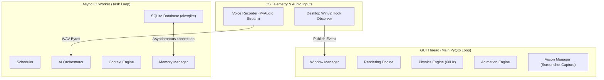
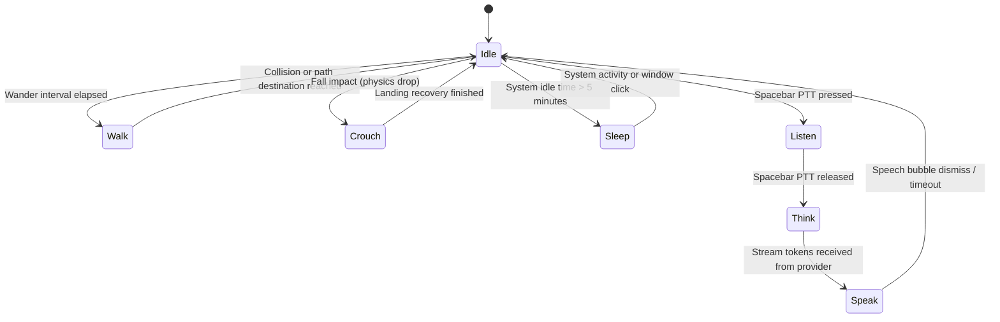

# Ambient AI Desktop Companion (Desk Pet)

An intelligent, lightweight, 2D virtual companion that lives directly on your Windows desktop. Designed as a living creature rather than a transactional chatbot, the pet walks, idles, reacts to user input, obeys gravity-based physics, remembers past conversations, and communicates using ambient typewriter dialogue powered by local triggers and external AI APIs.

---

## 📖 Table of Contents
1. [Vision & Design Philosophy](#-vision--design-philosophy)
2. [Core Features](#-core-features)
3. [Project Structure](#-project-structure)
4. [System Architecture](#-system-architecture)
   - [Asynchronous Event Bus](#asynchronous-event-bus)
   - [Thread Ownership Boundaries](#thread-ownership-boundaries)
   - [Mascot Animation State Machine](#mascot-animation-state-machine)
   - [Mascot Sprite Sheet & Frame Layout](#mascot-sprite-sheet--frame-layout)
5. [Database Schema](#-database-schema)
6. [API Integrations & Contracts](#-api-integrations--contracts)
7. [Performance Budgets](#-performance-budgets)
8. [Current Status & Audit Findings](#-current-status--audit-findings)
9. [Development Setup](#-development-setup)

---

## 🌟 Vision & Design Philosophy

Desktop Pet AI bridges the gap between static, repetitive desktop toys and heavy, intrusive browser-based AI chatbots. The key product principles are:
* **Always Ambient & Non-Intrusive:** The pet hovers over active workspaces without stealing keyboard focus or blocking critical OS UI (using `Qt.WindowType.Tool` window flags).
* **Physically Grounded:** Dropping or throwing the pet uses a custom kinematics simulation (60Hz loop) that calculates momentum, drag, and monitor bounds.
* **Contextually Aware:** Pulls local system metrics (battery, active foreground process, local time, and git/test status) to generate highly personalized developer-focused commentary.
* **Strict Decoupling:** All subsystems (UI, Physics, Animation, AI Orchestration, and Telemetry) communicate purely via an asynchronous event bus.

---

## 🛠️ Core Features

* **Frameless Transparent UI:** High-DPI responsive window that supports multi-monitor clipping and available work areas (excluding the system taskbar).
* **60Hz Physics Engine:** Gravity, friction, terminal velocity, dragging, and throwing momentum.
* **Sprite Animation Machine:** Slices 6-row × 10-column sheets (60 frames total) dynamically, using an LRU pixmap scaling cache to keep memory usage under control.
* **Conversational AI (Gemini 2.5 Flash / Krutrim):** Asynchronous streaming dialogue output mapped directly to custom speech bubbles.
* **Local Episodic Memory:** SQLite-backed persistent database that stores conversation logs, user profiles, reminders, and mascot preferences.
* **Interactive Controls:** Drag-and-throw kinematics, double-click jumps, head-tracking hover effects, and a custom context menu (scale adjustment, character theme selection, mute, Pomodoro timers, and database pruning).
* **Push-to-Talk Voice (Deepgram Nova-2):** On-demand microphone recording and transcription.

---

## 📁 Project Structure

```text
desktop-pet/
├── assets/
│   └── sprites/
│       └── default/          # 10x6 custom frame spritesheets & metadata.json
├── src/
│   ├── main.py               # Application Entry Point
│   ├── config.py             # Type-safe global config & validation
│   ├── constants.py          # Common states and enum types
│   ├── core/
│   │   ├── app.py            # Central thread coordinator & startup
│   │   ├── event_bus.py      # Decoupled Event Broker (pub/sub engine)
│   │   └── scheduler.py      # AI Invocation Scheduler & Throttling
│   ├── observer/
│   │   ├── win32_hook.py     # Low-level Windows hooks (WinEvents, idle timers)
│   │   └── telemetry.py      # Active usage stats tracking engine
│   ├── ai/
│   │   ├── orchestrator.py   # Context builder & LLM orchestrator
│   │   ├── context_engine.py # Aggregates active process details, battery, etc.
│   │   ├── memory.py         # Long term storage controller & recall
│   │   ├── vision.py         # On-demand screenshot compressor
│   │   ├── voice.py          # PyAudio recorder & STT transcriptor
│   │   └── providers/        # LLM Clients (Krutrim, Gemini, etc.)
│   ├── physics/
│   │   ├── gravity.py        # Kinematics simulator
│   │   ├── collision.py      # Desktop bounds & taskbar offset resolver
│   │   └── movement.py       # Wander, walk, jump, fall physics
│   ├── ui/
│   │   ├── window.py         # Transparent, frameless window manager
│   │   ├── renderer.py       # Painting & texture transformation
│   │   ├── animator.py       # Mascot animation state machine
│   │   ├── sprites.py        # Sprite loading & LRU memory cache
│   │   └── notifications.py  # Speech bubble & custom overlays
│   └── storage/
│       ├── db.py             # Asynchronous SQLite connector
│       └── repository.py     # Clean repository layer for DB tables
├── tests/                    # Unit testing suite
├── .env.example              # Sample environment variables config
├── requirements.txt          # Python dependencies (PyQt6, pyaudio, httpx, aiosqlite)
└── README.md                 # Project documentation
```

---

## 📐 System Architecture

### Asynchronous Event Bus
All communication between subsystems is mediated by the `EventBus`. Subsystems subscribe to events and publish payloads asynchronously. 

| Event Name | Source Module | Payload Structure | Action / Target Consumer |
| :--- | :--- | :--- | :--- |
| `APPLICATION_CHANGED` | Desktop Observer | `{"app_name": str, "title": str}` | Scheduler, Context Engine |
| `SCREEN_CHANGED` | Desktop Observer | `{"screen_id": int, "geometry": list}` | Physics Engine, Window Manager |
| `USER_IDLE` | Desktop Observer | `{"idle_duration_sec": int}` | Scheduler (Trigger Idle/Sleep state) |
| `BATTERY_LOW` | Desktop Observer | `{"battery_percent": int, "charging": bool}` | Scheduler (Trigger Warning Speech) |
| `SCREEN_STABLE` | Desktop Observer | `{"idle_duration_sec": int}` | Vision Scheduler Trigger |
| `TESTS_PASSED`/`FAILED` | Scheduler / Plugin | `{"suite": str, "failed_count": int}` | Animation state update (Cheer/Sad) |
| `VISION_CAPTURE_REQUESTED`| Scheduler | `{"prompt": str}` | Vision Manager, AI Orchestrator |
| `VOICE_RECORD_STARTED` | Window Manager | `{"timestamp": float}` | Voice Manager, Animator (Listen state) |
| `SPEECH_EMITTED` | AI Orchestrator | `{"text": str, "mode": str}` | Speech Bubble, Animator (Speak state) |

### Thread Ownership Boundaries
To guarantee a fluid, stutter-free 60 FPS presentation, code execution boundaries are strictly segregated. Thread communication occurs only via PyQt6 signals.



* **GUI Thread:** Handles widget painters, UI coordinate adjustments, double-buffered graphics scaling, and user interaction (clicks, hover, and drag).
* **Async IO Worker:** Persistent background loop (`asyncio`) executing network calls, LLM prompt generation, and SQLite read/writes.
* **Daemon Threads:** Win32 global event hooks and raw microphone audio buffer writing.

### Mascot Animation State Machine



### Mascot Sprite Sheet & Frame Layout

The companion's animations are backed by a single sheet: `spritesheet.png` (dimensions: 1380px width × 1146px height), located at `assets/sprites/default/spritesheet.png`. Each frame is exactly **138px wide by 191px high**.

To reference how coordinates map to animations, here is the visual frame map:


#### Frame Map Mapping:
* **Row 1 (y = 0px): `idle` & `sleep`**
  * `idle` (Frames 0–9): Mascot breathing, blinking.
  * `sleep` (Frames 6–8): Reuses frames from x=828px with a slower frame speed (700ms).
* **Row 2 (y = 191px): `walk`**
  * `walk` (Frames 0–9): Walk cycle (facing right; programmatically mirrored in PyQt6 for walking left).
* **Row 3 (y = 382px): `wave`**
  * `wave` (Frames 0–9): Waving greeting or cheer animation.
* **Row 4 (y = 573px): Physical & Drag Actions**
  * `crouch` (Frames 0–1): Impact landing frame/squash.
  * `sit` (Frame 1): Rest/sit frame (x=138px).
  * `launch` (Frame 2): Launch frame for jumps (x=276px).
  * `fall` (Frames 3–5): Falling downward frames.
  * `landing` (Frames 6–9): Recovering from impact.
  * `dragged` (Frames 4–6): Flailing legs frames when grabbed by cursor.
* **Row 5 (y = 764px): `think` & `listen`**
  * `think` (Frames 0–9): Hand-on-chin thinking loops.
  * `listen` (Frames 0–3): Listening to Push-to-Talk voice capture.
* **Row 6 (y = 955px): `talk`**
  * `talk` (Frames 0–9): Speaking animation with varying mouth heights.

All framing configurations, FPS values, loop rules, and frame-specific durations are defined dynamically in [metadata.json](./assets/sprites/default/metadata.json).

---

## 🗄️ Database Schema

The SQLite database (`pet_memory.db`) resides locally to ensure absolute data privacy and rapid data queries (target latency < 5ms).

```sql
-- Persistent mascot/user settings
CREATE TABLE IF NOT EXISTS settings (
    key TEXT PRIMARY KEY,
    value TEXT NOT NULL,
    updated_at TIMESTAMP DEFAULT CURRENT_TIMESTAMP
);

-- Conversation History (Context window bounded to the latest N messages)
CREATE TABLE IF NOT EXISTS conversation (
    id INTEGER PRIMARY KEY AUTOINCREMENT,
    timestamp TIMESTAMP DEFAULT CURRENT_TIMESTAMP,
    role TEXT NOT NULL,          -- 'user' or 'assistant'
    message TEXT NOT NULL
);

-- Long-Term Episodic Memory Facts extracted from conversation
CREATE TABLE IF NOT EXISTS memory (
    key TEXT PRIMARY KEY,
    val TEXT NOT NULL,
    last_updated TIMESTAMP DEFAULT CURRENT_TIMESTAMP
);

-- Active application usage telemetry log
CREATE TABLE IF NOT EXISTS application_usage (
    id INTEGER PRIMARY KEY AUTOINCREMENT,
    app_name TEXT NOT NULL,
    window_title TEXT,
    duration_seconds INTEGER NOT NULL,
    logged_date DATE DEFAULT (CURRENT_DATE)
);
CREATE INDEX IF NOT EXISTS idx_usage_date ON application_usage (logged_date);

-- Scheduled reminders
CREATE TABLE IF NOT EXISTS reminders (
    id INTEGER PRIMARY KEY AUTOINCREMENT,
    trigger_time DATETIME NOT NULL,
    task_description TEXT NOT NULL,
    is_completed INTEGER DEFAULT 0
);
```

---

## 🔌 API Integrations & Contracts

### 1. Large Language Model (Gemini 2.5 Flash / Krutrim)
* **API Endpoints:**
  * Gemini API: `https://generativelanguage.googleapis.com/v1beta`
  * Krutrim completions API: `https://cloud.olakrutrim.com/v1/chat/completions`
* **Sample Payload:**
```json
{
  "model": "gemini-2.5-flash",
  "messages": [
    { "role": "system", "content": "You are a small desktop pet..." },
    { "role": "user", "content": "User prompt + context block" }
  ],
  "max_tokens": 150,
  "temperature": 0.7,
  "stream": true
}
```

### 2. Speech-to-Text (Deepgram Nova-2)
* **ASR Endpoint:** `https://api.deepgram.com/v1/listen?model=nova-2&smart_format=true`
* **Headers:** `Authorization: Token <DEEPGRAM_API_KEY>`, `Content-Type: audio/wav`
* **Format:** Mono 16kHz PCM raw `.wav` byte streams.

---

## 📊 Performance Budgets

To keep the application ambient and prevent it from competing with active compilation, rendering, or gaming pipelines, strict target budgets are set:

| Resource Metric | Maximum Target Budget | Mitigation Strategy |
| :--- | :--- | :--- |
| **CPU Usage (Idle)** | `< 1.0%` | Suspend paint/physics tickers when static; sleep idle worker threads. |
| **CPU Usage (Active)** | `< 2.0%` | Run file I/O, networking, and telemetry parsing on background threads. |
| **RAM Footprint** | `< 180MB` (max `< 300MB`) | Slice sprite sheets dynamically; purge inactive animation cache after 60s. |
| **Storage Size** | `< 15MB` | Execute database pruning loops (keep latest 100 messages/30-day logs). |
| **GUI Latency** | Target 60 FPS | PyQt frame intervals locked at `16.6ms`. |
| **AI Stream Latency** | `< 2.0` seconds | Initiate asynchronous streaming with typewriter UI rendering on first token chunk. |

---

## 🔍 Current Status & Audit Findings

> [!WARNING]
> **Active Development Warning & Re-Architecture Phase**
> A recent engineering audit identified structural issues currently being addressed before a production release:

1. **Event Bus Thread Defect (AV-1):** Background-thread subscribers (e.g. state machine, scheduler, and telemetry) do not receive event notifications because they run on an `asyncio` event loop instead of a Qt event dispatcher. (This prevents walking, falling gravity, and telemetry database writes at runtime; the pet currently hangs in mid-air).
2. **AI Orchestrator Wiring (AV-2):** `AIOrchestrator` is not instantiated at startup, disabling chat query handlers and leading to `AttributeError` when triggering screenshot captures.
3. **Singleton Thread Races (AV-3/AV-4):** Concurrent initialization of components (`SpriteLoader`, `EventBus`) from separate threads causes non-deterministic startup races.
4. **Security Corrections (C-5):**
   * **Do not log API keys:** Ensure API keys are loaded via the header (`x-goog-api-key`) rather than embedded in HTTP URL strings, which can leak into logs and error exceptions.
   * **Sanitize logging:** Do not output active workspace window titles at `INFO` level to prevent credentials/sensitive filenames from writing to `app.log`.
5. **Performance Improvements:**
   * Paint events currently execute at a continuous 60Hz loop even when the mascot is static. We are moving to a dirty-region / frame-advance repaint trigger.
   * Screen capture must be downscaled (≤1024px) and compressed off the main GUI thread to avoid visual frames dropping.

---

## 🚀 Development Setup

### Prerequisites
* Windows 10/11 (for full Win32 hook and battery monitor features)
* Python 3.11+
* C compiler (required for `PyAudio` compilation on Windows if using binary wheels)

### Installation
1. Clone the repository:
   ```bash
   git clone https://github.com/GugulothBhuvan/ribbit-desktop-pet.git
   cd ribbit-desktop-pet
   ```
2. Create and activate a virtual environment:
   ```bash
   python -m venv .venv
   .venv\Scripts\activate
   ```
3. Install dependencies:
   ```bash
   pip install -r requirements.txt
   ```
4. Copy the environment template and insert your API credentials:
   ```bash
   copy .env.example .env
   ```
5. Edit `.env` to configure your API keys:
   * `GEMINI_API_KEY` (Gemini API access)
   * `KRUTRIM_API_KEY` (Alternative LLM provider)
   * `DEEPGRAM_API_KEY` (Audio ASR transcription service)

### Running the App
Start the main application loop:
```bash
python -m src.main
```

### Running Tests
Execute the test suite to verify module components:
```bash
pytest
```
