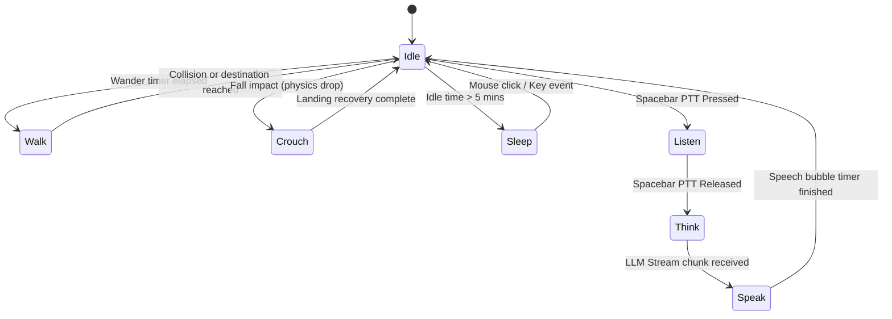
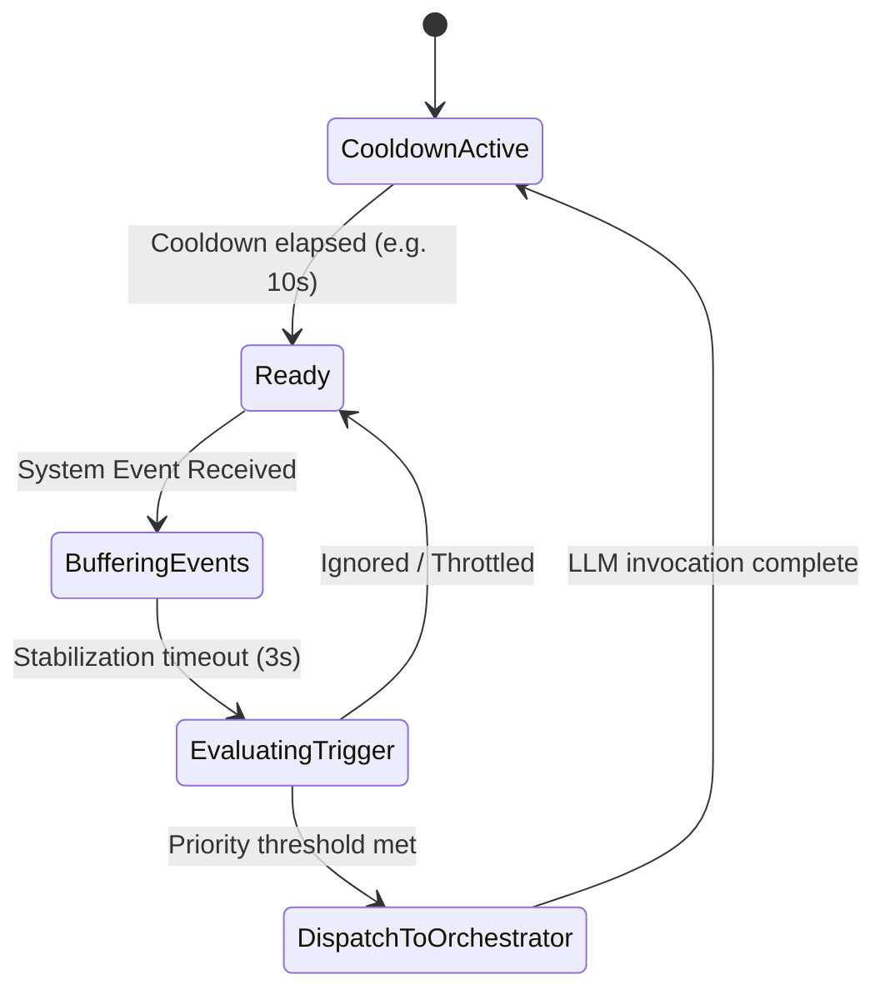
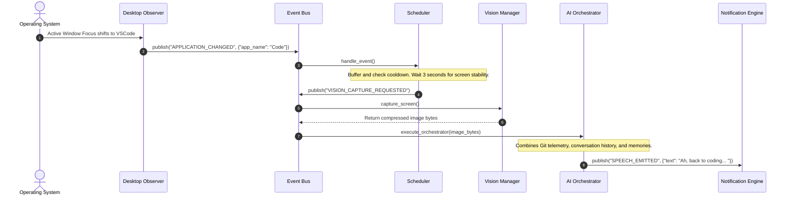

# Software Architecture Specification - Ambient AI Desktop Companion

This document establishes the complete, production-grade software architecture for the **Ambient AI Desktop Companion**. The application is designed around a loosely coupled, fully event-driven architecture where modules communicate strictly via an asynchronous **Event Bus**.

---

## 1. Project Directory Structure

```text
desk-pet/
├── .env                  # Secrets, API Keys, Local Overrides
├── requirements.txt      # Checked dependencies (PyQt6, pyaudio, httpx, aiosqlite)
├── src/
│   ├── main.py           # Application Entry Point
│   ├── config.py         # Type-safe global config & validation
│   ├── constants.py      # Common states and enum types
│   │
│   ├── core/
│   │   ├── app.py        # Central thread coordinator & startup
│   │   ├── event_bus.py  # Decoupled Event Broker (pub/sub engine)
│   │   └── scheduler.py  # AI Invocation Scheduler & Throttling
│   │
│   ├── observer/
│   │   ├── base.py       # OS Hook interface
│   │   ├── win32_hook.py # Low-level Windows hooks (WinEvents, idle timers)
│   │   └── telemetry.py  # Active usage stats tracking engine
│   │
│   ├── ai/
│   │   ├── orchestrator.py   # Context builder & LLM orchestrator
│   │   ├── context_engine.py # Aggregates active process details, battery, etc.
│   │   ├── memory.py         # Long term storage controller & recall
│   │   ├── vision.py         # On-demand screenshot compressor
│   │   ├── voice.py          # PyAudio recorder & STT transcriptor
│   │   └── providers/        # LLM Clients (Krutrim, etc.)
│   │
│   ├── physics/
│   │   ├── gravity.py        # Kinematics simulator
│   │   ├── collision.py      # Desktop bounds & taskbar offset resolver
│   │   └── movement.py       # Wander, walk, jump, fall physics
│   │
│   ├── ui/
│   │   ├── window.py         # Transparent, frameless window manager
│   │   ├── renderer.py       # Painting & texture transformation
│   │   ├── animator.py       # Mascot animation state machine
│   │   ├── sprites.py        # Sprite loading & LRU memory cache
│   │   └── notifications.py  # Native/overlay custom speech bubble alerts
│   │
│   ├── storage/
│   │   ├── db.py             # Asynchronous SQLite connector
│   │   └── repository.py     # Clean repository layer for DB tables
│   │
│   └── plugins/
│       ├── base.py           # Plugin Interface
│       └── manager.py        # Dynamic .py loader & hook registrator
│
├── assets/
│   └── sprites/
│       └── default/          # 10x6 custom frame spritesheet & metadata.json
│
└── tests/
    ├── conftest.py
    └── test_modules.py       # Unit tests verifying event-driven decoupling
```

---

## 2. Module Responsibilities

The application is decomposed into 15 independent, single-responsibility modules:

| Module | Core Responsibility | Thread Context |
| :--- | :--- | :--- |
| **Desktop Observer** | Tracks window changes, keyboard/mouse hooks, system idle metrics, usage times. | OS Hook Daemon Thread |
| **Event Bus** | Centrally dispatches events asynchronously; enforces module decoupling. | Main PyQt GUI Thread |
| **Scheduler** | Groups events, manages stateful cooldowns, prioritizes AI invocation triggers. | Asynchronous Event Thread |
| **AI Orchestrator** | Coordinates prompt assembly (telemetry, memory, history) and drives LLM API calls. | Asynchronous Event Thread |
| **Context Engine** | Resolves active screen properties, battery status, foreground process metadata. | Asynchronous Event Thread |
| **Memory Manager** | Controls access to SQLite-backed episodic context and long-term user profile facts. | Asynchronous Event Thread |
| **Vision Manager** | Captures, crops, and compresses primary monitor screen frames on-demand. | Main PyQt GUI Thread |
| **Voice Manager** | Records raw microphone input (Spacebar PTT) and transcribes using ASR (Deepgram). | Background Daemon Thread |
| **Physics Engine** | Calculates mascot trajectories, velocities, wall/floor collisions, and drag. | Main PyQt GUI Thread (60Hz) |
| **Animation Engine** | Manages frame transitions, lock states (e.g., wake lock), and speaking states. | Main PyQt GUI Thread (60Hz) |
| **Rendering Engine** | Draw coordinator using double-buffered PyQt6 painters and horizontal flipping. | Main PyQt GUI Thread (60Hz) |
| **Sprite Manager** | Slices frame sheets, performs scaling, and runs an LRU cache to release textures. | Main PyQt GUI Thread |
| **Window Manager** | Manages frameless OS overlay settings, window offsets, dragging, and hover focus. | Main PyQt GUI Thread |
| **Notification Engine** | Typesets speech bubbles dynamically and coordinates ambient overlay alerts. | Main PyQt GUI Thread |
| **Plugin Manager** | Auto-discovers and dynamically registers python classes mapping custom Event hooks. | Main PyQt GUI Thread |

---

## 3. Interface Definitions

Every module communicates strictly via event-based payload payloads. However, internal interfaces are defined as abstract protocols to enable independent unit testing and mock injections.

```python
from typing import Protocol, Callable, Dict, Any, List

class IEventBus(Protocol):
    def subscribe(self, event_type: str, callback: Callable[[Dict[str, Any]], None]) -> None:
        """Register a handler for a specific event type."""
        ...
        
    def publish(self, event_type: str, data: Dict[str, Any]) -> None:
        """Dispatch event asynchronously to all subscribed handlers."""
        ...

class IObserver(Protocol):
    def start_monitoring(self) -> None:
        """Initialize low-level system hooks."""
        ...
    def stop_monitoring(self) -> None:
        """Release OS hooks cleanly."""
        ...

class IAIScheduler(Protocol):
    def handle_event(self, event_type: str, data: Dict[str, Any]) -> None:
        """Receive system event, evaluate criteria, and schedule model runs."""
        ...

class IAIOrchestrator(Protocol):
    async def invoke_llm(self, trigger_prompt: str, include_vision: bool = False) -> str:
        """Build context and complete completion requests."""
        ...

class IVisionManager(Protocol):
    def capture_screen(self, compression_level: int = 80) -> bytes:
        """Capture the screen, compress to PNG bytes, and return data."""
        ...

class IVoiceManager(Protocol):
    def start_recording(self) -> None:
        """Open raw microphone stream and record bytes."""
        ...
    def stop_recording(self) -> str:
        """Close stream and return WAV file path."""
        ...
```

---

## 4. Event Catalog

The entire lifecycle of the companion is driven by events. The following defines the complete list of system events:

| Event Name | Source Module | Payload Structure | Action / Target Consumer |
| :--- | :--- | :--- | :--- |
| `APPLICATION_CHANGED` | Desktop Observer | `{"app_name": str, "title": str}` | Scheduler, Context Engine |
| `SCREEN_CHANGED` | Desktop Observer | `{"screen_id": int, "geometry": list}` | Physics Engine, Window Manager |
| `USER_IDLE` | Desktop Observer | `{"idle_duration_sec": int}` | Scheduler (Trigger Idle Mascot Animation) |
| `USER_ACTIVE` | Desktop Observer | `{"active_time": float}` | Scheduler (Trigger Wake Mascot Animation) |
| `BATTERY_LOW` | Desktop Observer | `{"battery_percent": int, "charging": bool}` | Scheduler (Trigger Warn Animation / Speech) |
| `SCREEN_STABLE` | Desktop Observer | `{"idle_duration_sec": int}` | Scheduler (Eligible for vision trigger) |
| `TESTS_PASSED` | Scheduler / Plugin | `{"suite": str}` | Window Manager, Animation Engine (Cheer) |
| `TESTS_FAILED` | Scheduler / Plugin | `{"failed_count": int}` | Window Manager, Animation Engine (Sad) |
| `VISION_CAPTURE_REQUESTED`| Scheduler | `{"prompt": str}` | Vision Manager, AI Orchestrator |
| `VOICE_RECORD_STARTED` | Window Manager | `{"timestamp": float}` | Voice Manager, Animation Engine (Listen) |
| `VOICE_RECORD_STOPPED` | Window Manager | `{"timestamp": float}` | Voice Manager, AI Orchestrator (Think) |
| `SPEECH_EMITTED` | AI Orchestrator | `{"text": str, "mode": str}` | Notification Engine, Animation Engine (Speak) |
| `STATE_TRANSITION` | Animation Engine | `{"from": str, "to": str}` | Physics Engine, Window Manager |

---

## 5. State Diagrams

### Mascot Animation State Machine


### AI Invocation Scheduler Logic


---

## 6. Sequence Diagrams

### End-to-End Ambient Event Invocation


---

## 7. Database Schema (SQLite)

The sqlite database `pet_memory.db` utilizes foreign key integrity and indexes to process real-time queries in under 5ms.

```sql
-- Settings Table (Persistent overrides)
CREATE TABLE IF NOT EXISTS settings (
    key TEXT PRIMARY KEY,
    value TEXT NOT NULL,
    updated_at TIMESTAMP DEFAULT CURRENT_TIMESTAMP
);

-- Conversation History (Bounded to 20 messages for context size)
CREATE TABLE IF NOT EXISTS conversation_logs (
    id INTEGER PRIMARY KEY AUTOINCREMENT,
    sender TEXT NOT NULL,          -- 'user' or 'pet'
    message TEXT NOT NULL,
    timestamp TIMESTAMP DEFAULT CURRENT_TIMESTAMP
);

-- Long-Term Episodic Memory Facts
CREATE TABLE IF NOT EXISTS long_term_memories (
    id INTEGER PRIMARY KEY AUTOINCREMENT,
    fact TEXT NOT NULL,
    importance_score INTEGER DEFAULT 1, -- Scale 1 to 5
    created_at TIMESTAMP DEFAULT CURRENT_TIMESTAMP
);

-- Application Usage Logs (Observer Telemetry)
CREATE TABLE IF NOT EXISTS application_usage (
    id INTEGER PRIMARY KEY AUTOINCREMENT,
    app_name TEXT NOT NULL,
    window_title TEXT,
    duration_seconds INTEGER NOT NULL,
    logged_date DATE DEFAULT (CURRENT_DATE)
);
CREATE INDEX IF NOT EXISTS idx_usage_date ON application_usage (logged_date);
```

---

## 8. API Contracts

### Krutrim Chat Completions Endpoint
* **URL**: `https://cloud.olakrutrim.com/v1/chat/completions`
* **Method**: `POST`
* **Headers**: 
  ```json
  {
    "Authorization": "Bearer <KRUTRIM_API_KEY>",
    "Content-Type": "application/json"
  }
  ```
* **Payload Request Model**:
  ```json
  {
    "model": "krutrim-2-instruct",
    "messages": [
      { "role": "system", "content": "System Prompt & telemetry context details" },
      { "role": "user", "content": "Query" }
    ],
    "max_tokens": 60,
    "temperature": 0.7,
    "stream": true
  }
  ```

### Deepgram STT Rest Endpoint
* **URL**: `https://api.deepgram.com/v1/listen?model=nova-2&smart_format=true`
* **Method**: `POST`
* **Headers**:
  ```json
  {
    "Authorization": "Token <DEEPGRAM_API_KEY>",
    "Content-Type": "audio/wav"
  }
  ```
* **Binary Request Body**: Raw mono 16kHz PCM `.wav` byte buffer.

---

## 9. Performance Budget

To ensure the companion remains ambient and low-overhead, we establish a strict resource budget:

| Resource Metric | Maximum Target | Action if Exceeded |
| :--- | :--- | :--- |
| **CPU Usage** | < 1.5% average (peaks < 5% during slices) | Throttling observer polling rates; sleep background thread. |
| **RAM Footprint** | < 120 MB | Flush Sprite Loader LRU cache; run `gc.collect()`. |
| **Storage DB Size**| < 15 MB | Purge conversation logs beyond the latest 100 entries. |
| **API Costs (STT)**| < $0.05 / hour | Enforce hardware-side debounce (min 1 second recording). |
| **FPS Rendering** | Capped at 30 FPS | PyQt frame interval locked dynamically at `33ms`. |

---

## 10. Thread Ownership Mapping

To prevent race conditions, database locking errors, and PyQt GUI thread crash locks, we segregate all operations into strictly defined thread boundaries:

```mermaid
graph TD
    subgraph GUI Thread (Main Thread)
        UI[Window Manager]
        Rdr[Rendering Engine]
        Phys[Physics Engine]
        Anim[Animation Engine]
        Vis[Vision Manager]
    end

    subgraph Async IO Thread (Task Worker Loop)
        Sch[Scheduler]
        Orch[AI Orchestrator]
        Ctx[Context Engine]
        Mem[Memory Manager]
        DB[SQLite Database]
    end

    subgraph OS Event Thread (Daemon Hook Listener)
        Obs[Desktop Observer]
    end
    
    subgraph Audio Thread (Daemon Recording Stream)
        Voice[Voice Manager]
    end

    Obs -->|Publish Event| UI
    Voice -->|WAV Bytes| Orch
    DB <-->|AioSqlite Connection| Mem
```

* **GUI Thread**: Executes all painting, mouse drag triggers, coordinate alterations, and UI widgets.
* **Async IO Thread**: Operates on a dedicated, persistent worker event loop. Enforces prompt compilations, file writes, network requests, and database queries.
* **OS Event Thread**: Intercepts keyboard/mouse/active window telemetry and publishes messages to the Event Bus asynchronously.
